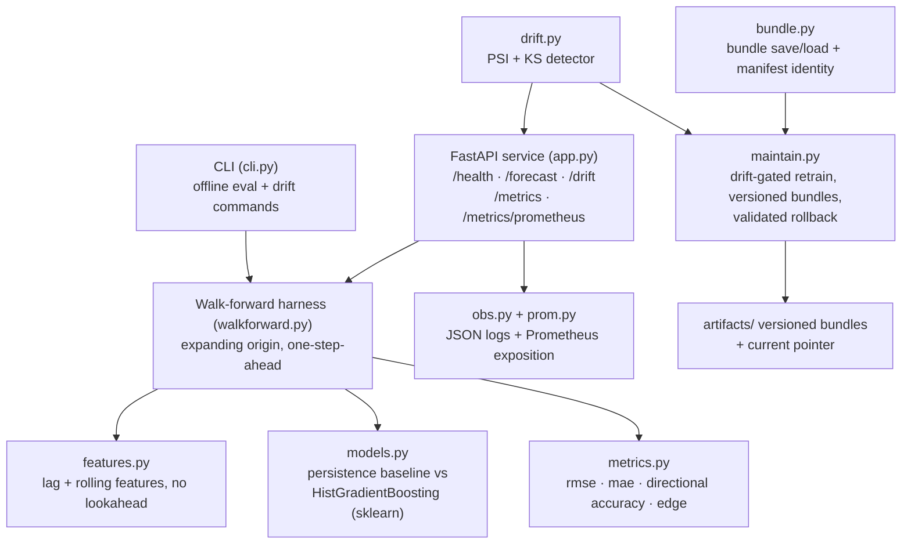

# advanced_stock_prediction_app

Time-series stock forecasting with drift monitoring and retraining. This is the
forecasting + maintain pillar of a personal AI-engineering portfolio.

**Live deployment: deliberately none.** Local Docker Compose is the deploy
target; a public endpoint was explicitly declined (see
[Deploy target decision](#deploy-target-decision)). A reviewer runs everything
from this repo, offline.

## What is this? (plain-language overview)

This app predicts the next day's stock price movement and - the part that
makes it distinctive - manages the whole life of that model afterwards: it
detects when the market has drifted away from what the model learned, retrains
on request, versions every model artifact, and rolls back safely. It is the
"what happens after you ship a model" story, done honestly and locally.

Two models run through the identical evaluation loop:

- **persistence** - "tomorrow will be like today" (the forecast close equals
  the last known close). Simple, hard to beat, and the honest bar every
  fancier model must clear.
- **HistGradientBoosting** (scikit-learn, defaults, no tuning) - predicts the
  next daily log return from the last five returns plus rolling mean/volatility
  features, always computed without peeking at the future.

You can drive it three ways:

1. **The CLI** - fully offline against a committed synthetic fixture, printing
   walk-forward evaluation metrics for both models.
2. **The HTTP API** - `POST /forecast` runs the real harness and returns
   metrics plus the final forecast; every response also carries a `drift`
   object saying whether the drift detector fired.
3. **The observability stack** - `docker compose up` runs the API with local
   Prometheus and Grafana (14-panel dashboard of forecasts, latency, drift and
   evaluation gauges), so the maintain story is visible, not just described.

| | |
| --- | --- |
| Deploy target | Local Docker Compose only (public hosting deliberately declined) |
| Data | Yahoo Finance daily closes via `yfinance` (optional, cached); committed synthetic fixtures for everything offline |
| Models | persistence baseline + sklearn `HistGradientBoostingRegressor`, both untuned |
| Validation | expanding-origin walk-forward, strict one-step-ahead, two dedicated leak-detection tests |
| Drift detection | PSI (5 quantile bins) + KS test on daily log returns; documented retrain signal PSI >= 0.25 or KS p <= 0.01 |
| Maintain | drift-gated retrain into NEW versioned bundles (never overwrites) + validated pointer rollback |
| Backend tests | 88 passing, offline and deterministic (`make test`) |
| Honest scope | educational only; nothing here is investment advice; no auth, no TLS, no multi-user serving |

## Architecture at a glance



Where things live:

| Path | What it is |
| --- | --- |
| `src/stock_prediction/data.py` | Yahoo Finance fetch with 24 h cache; committed offline fixtures |
| `src/stock_prediction/features.py` | Lag/rolling features with a strict no-lookahead contract |
| `src/stock_prediction/models.py` | Persistence baseline and HistGradientBoosting (sklearn defaults) |
| `src/stock_prediction/walkforward.py` | The model-agnostic expanding-origin harness both models share |
| `src/stock_prediction/metrics.py` | RMSE, MAE, directional accuracy, edge |
| `src/stock_prediction/bundle.py` | Versioned model bundles + manifest identity (config, data hash, sklearn version) |
| `src/stock_prediction/drift.py` | PSI + KS drift detector with documented thresholds |
| `src/stock_prediction/maintain.py` | Drift-gated retrain and pointer rollback (the Stage 6 story) |
| `src/stock_prediction/app.py` | FastAPI service; every `/forecast` response carries a `drift` object |
| `src/stock_prediction/obs.py`, `prom.py` | Structured JSON logs and the stdlib Prometheus endpoint |
| `tests/` | 88 offline tests, including two leak-detection tests and a spy-model walk-forward audit |
| `experiments/` | Recorded eval + drift logs, results CSV, and an executed incident write-up |
| `artifacts/` | Versioned model bundles and the `current` pointer |
| `observability/` | Prometheus scrape config + Grafana datasource/dashboard provisioning |
| `INVENTORY.md` | Historical audit of the pre-refactor app |
| `ROADMAP.md` | The stage-by-stage build story |

## Quickstart (local, offline)

```bash
git clone https://github.com/PCSchmidt/advanced-stock-prediction-app
cd advanced-stock-prediction-app
make setup && make test    # pinned venv, then 88 offline tests + ruff

# CLI evaluation of both models on the committed fixture:
python -m stock_prediction.cli --fixture tests/fixtures/sample_daily.csv --model both

# HTTP service + local Prometheus/Grafana (Docker Desktop required):
docker compose up --build -d
curl -s -X POST http://localhost:8000/forecast \
  -H "Content-Type: application/json" -d '{"model": "both", "last_k": 5}'
# Grafana: http://localhost:3003 (admin/admin) · Prometheus: http://localhost:9093
```

## Approach: why it is built this way

- **No lookahead, proven not promised.** Features for time `t` are computed
  only from closes strictly before `t`, and two dedicated tests enforce it:
  one perturbs the future tail and asserts earlier feature rows are unchanged;
  the other uses a spy model to audit every `fit` call in the walk-forward
  loop against the origin.
- **The baseline is honest.** Persistence runs through the identical harness
  and is reported first. Any model in this repo is measured against what
  "tomorrow equals today" achieves - the bar sophisticated models actually
  struggle to clear on daily returns.
- **Nothing is tuned.** sklearn defaults, no hyperparameter search, no
  invented production SLOs. The recorded Stage 2 numbers in
  `experiments/eval_log.md` are the evaluation source of truth, and the README
  says so instead of claiming live accuracy.
- **Retraining never destroys anything.** A retrain writes a NEW versioned
  bundle directory (manifest: feature config, fixture hash, sklearn version,
  git commit) and moves a pointer; rollback flips the pointer back only after
  validating the target's identity. A quiet drift check no-ops with a clear
  message instead of touching the model.
- **Offline-first.** Live fetching is opt-in behind an explicit flag, cached,
  and lazily imported; tests and CI never touch the network. Every recorded
  number in `experiments/` is regenerable from committed fixtures.
- **Boring, well-supported tooling.** Python + NumPy/pandas + scikit-learn +
  FastAPI + Docker, stdlib-only Prometheus exposition - chosen so a reviewer
  can read and run everything, not so a resume keyword list gets longer.

## Motivation

The goal is to demonstrate the full AI engineering lifecycle on a financial
forecasting problem, with the maintain stage as the differentiator: how the
model degrades as market data drifts, how degradation is detected, and how the
model is retrained.

**This project is educational only. Nothing in this repository is investment
advice, and no forecast here should be traded on.**

## Method

Stage 1 (forecasting core) is implemented:

- **Data.** Daily close prices from Yahoo Finance via `yfinance` (free,
  documented source). Live fetching is optional and cached: `fetch_prices`
  writes a CSV under `data/cache/` (gitignored, 24 h TTL) and reads it back
  without network access while fresh. The `yfinance` import is lazy, so tests
  and CI never touch the network. All committed evaluation runs use
  `tests/fixtures/sample_daily.csv`, a small (300-row) synthetic geometric
  random walk committed as an offline fixture.

- **Features (no lookahead).** Features for target time `t` are computed only
  from closes strictly before `t`: the last five daily log returns
  (`ret_lag_1..5`), and rolling mean and standard deviation of daily log
  returns over the previous 10 and 20 days (`roll_mean_10`, `roll_std_10`,
  `roll_mean_20`, `roll_std_20`), all shifted so they end at `t-1`. Returns
  are used because raw prices are non-stationary; lags carry short-term
  momentum; rolling stats summarize recent trend and volatility. A dedicated
  leak-detection test perturbs the future tail of the series and asserts
  earlier feature rows are unchanged (see Limitations for what this does and
  does not prove).

- **Baseline.** A persistence (random-walk) forecast: tomorrow's predicted
  return is zero, so the forecast close equals the last known close. It is
  implemented as a model object and runs through the identical harness as the
  primary model. It is the thing to beat in Stage 2.

- **Primary model.** `sklearn.ensemble.HistGradientBoostingRegressor` (sklearn
  defaults, no tuning) over the feature matrix above, predicting the next daily
  log return; the harness converts the predicted return to a forecast close via
  `last_close * exp(pred_return)`. Chosen because it is fast, deterministic for
  fixed data, captures simple nonlinear interactions among the lag/rolling
  features, and stays in boring, well-supported tooling. No deep learning, no
  fit-on-all-history-then-forecast-30-days (the original app's anti-pattern): this is
  strict one-step-ahead forecasting.

- **Walk-forward validation.** Expanding-origin walk-forward: at each origin
  `t` the model fits only on rows whose target time is strictly before `t`,
  predicts step `t`, then rolls forward one step. The harness is model-agnostic
  (any object with `fit`/`predict`), so baseline and primary model share the
  exact same loop. A second leak-detection test uses a spy model that records
  every `fit` call and asserts no training target is ever at or after the
  origin, for every origin in the run.

Run it offline with the committed fixture:

```
python -m stock_prediction.cli --fixture tests/fixtures/sample_daily.csv --model both
```

## Results

Stage 2 measured the Stage 1 pipeline as-is (no tuning). Both models ran through
the same expanding-origin walk-forward harness on four committed offline
fixtures (the original 300-day synthetic random walk plus three more synthetic
regimes: trending, mean-reverting, volatility-regime-shift), scoring 219
walk-forward origins per fixture (full window), split into first-half and
second-half windows. Metrics are on the next-step log return the harness
forecasts; full tables and definitions are in `experiments/eval_log.md` and
`experiments/results.csv` (regenerate with `make eval`).

Full-window results (RMSE/MAE in log-return units; dir. acc. = directional
accuracy over side-taking forecasts; edge = mean(sign(predicted return) *
realized return) of a long/flat strategy; always-long = mean realized return,
context only):

| Fixture | Model | n | RMSE | MAE | Dir. acc. | Edge | Always-long |
| --- | --- | --- | --- | --- | --- | --- | --- |
| sample_daily | persistence | 219 | 0.014733 | 0.011528 | n/a | 0.0 | -0.000816 |
| sample_daily | hist_gradient_boosting | 219 | 0.016002 | 0.012762 | 0.534 | +0.001375 | -0.000816 |
| trending_up | persistence | 219 | 0.009808 | 0.007636 | n/a | 0.0 | +0.000122 |
| trending_up | hist_gradient_boosting | 219 | 0.010685 | 0.008519 | 0.521 | +0.000721 | +0.000122 |
| mean_reverting | persistence | 219 | 0.011688 | 0.009096 | n/a | 0.0 | +0.000029 |
| mean_reverting | hist_gradient_boosting | 219 | 0.013162 | 0.010449 | 0.484 | -0.001023 | +0.000029 |
| vol_regime_shift | persistence | 219 | 0.015118 | 0.011254 | n/a | 0.0 | +0.000532 |
| vol_regime_shift | hist_gradient_boosting | 219 | 0.016765 | 0.012242 | 0.479 | -0.000739 | +0.000532 |

What the numbers say (honestly):

- **The primary model does not beat the baseline on forecast accuracy.**
  Persistence has lower RMSE and MAE than hist_gradient_boosting on all four
  fixtures, in both half-windows as well as the full window.
- **Directional accuracy is a coin flip.** GBM directional accuracy is
  0.479-0.534 across fixtures (persistence takes no side, so its directional
  accuracy is undefined, not zero).
- **The edge proxy is mixed and tiny.** GBM's long/flat edge is positive on
  sample_daily (+0.001375) and trending_up (+0.000721) - the only windows where
  it beats both persistence's 0.0 and always-long - and negative on
  mean_reverting (-0.001023) and vol_regime_shift (-0.000739). Magnitudes are
  a few basis points per step at n=219 with no significance testing.
- This is the expected outcome for one-step-ahead return forecasting on
  synthetic random walks; it is recorded as the Stage 2 baseline comparison,
  not hidden. Any future tuning must beat these recorded numbers.

## Monitor (Stage 5 drift detection)

Stage 5 adds read-only drift detection (`src/stock_prediction/drift.py`): the
detector compares the daily log-return distribution between two windows with
PSI (5 quantile bins) and a two-sample KS test. It fits nothing and predicts
nothing; the models, features, and `min_train_rows` are exactly the Stage 1-2
ones, and the Stage 2 results above are unchanged.

- **Windows.** Within one series: first half vs second half, split at the
  midpoint row. Between two series: full baseline vs full candidate. Log
  returns are computed within each window.
- **Thresholds (the signal that triggers the Stage 6 retrain, on demand).** A
  comparison fires when `PSI >= 0.25` (significant band of the standard
  Siddiqi 2006 credit-scoring convention: < 0.1 stable, 0.1-0.25 moderate,
  > 0.25 significant) or when the KS p-value `<= 0.01`. 5 bins (not the
  conventional 10) because with ~150 observations per window a 10-bin PSI is
  noise-dominated (matched halves of stationary fixtures scored PSI ~ 0.32
  with 10 bins, above the retrain line; < 0.05 with 5).
- **Why only log returns.** The lag features are the same series shifted, and
  rolling mean/std windows overlap so heavily that a KS test on them is
  anti-conservative at n~150 (see drift.py docstring for the measured
  example). The log-return series has no such overlap.

Recorded numbers (`make drift` regenerates `experiments/drift_log.md`;
deterministic on the committed fixtures):

| Comparison | PSI | Band | KS stat | KS p | Fired |
| --- | --- | --- | --- | --- | --- |
| sample_daily halves | 0.0362 | stable | 0.0940 | 0.528 | no |
| trending_up halves | 0.0362 | stable | 0.0940 | 0.528 | no |
| mean_reverting halves | 0.0170 | stable | 0.0738 | 0.813 | no |
| vol_regime_shift halves | 1.1315 | significant | 0.3356 | <0.001 | YES |
| sample_daily vs vol_regime_shift | 0.1549 | moderate | 0.1438 | 0.004 | YES |
| sample_daily vs trending_up (mean drift) | 0.2394 | moderate | 0.1472 | 0.003 | YES |
| sample_daily vs mean_reverting | 0.0659 | stable | 0.0936 | 0.145 | no |
| sample_daily vs itself | 0.0000 | stable | 0.0000 | 1.000 | no |

Reading: the known shifted pair (`vol_regime_shift`, whose sigma doubles
halfway) fires decisively; matched windows of the stationary fixtures stay
quiet; the pure mean-drift pair (`trending_up`) fires on the KS criterion
while its PSI sits in the moderate band -- the +0.0008 mean shift is real but
small next to sigma ~ 0.01-0.014. `sample_daily` vs `mean_reverting` stays
quiet because the detector compares marginal distributions and cannot see the
AR(1) autocorrelation difference (documented limitation, not hidden).

Honest scope: every number above comes from committed SYNTHETIC fixtures.
This is not production monitoring: there is no alerting, no scheduler, no
24/7 process, and no live data behind these results.

## Limitations

- Drift detection (Stage 5) is read-only and runs on committed synthetic
  fixtures. The maintain loop it feeds (Stage 6) is an offline, ON-DEMAND
  CLI: retraining runs only when a human executes it and the detector fires,
  and rollback is a validated pointer switch. There is no scheduler, no
  background process, no automated loop, and no alerting anywhere in this
  repository. Thresholds were recorded on synthetic walks; live-market
  behavior of the thresholds is untested.
- `GET /metrics` and `GET /metrics/prometheus` counters are per-process
  memory: they reset on restart and aggregate nothing across processes. The
  Phase 6 Prometheus/Grafana stack is LOCAL docker compose only (verified on
  this machine): no alerting, no remote storage, no hosted monitoring, no
  dashboard published anywhere. Prometheus keeps no volume, so its history
  dies with the container; the eval gauges are static offline artifacts, not
  live quality measurements.
- All Stage 2 evaluation runs on committed synthetic series (random-walk-style
  fixtures), not real market data. Performance on synthetic walks is not
  market skill and demonstrates nothing about trading ability. Real data
  requires the network fetch path, which CI does not exercise; no live-market
  results are claimed anywhere in this repository.
- n is small: 219 walk-forward origins per fixture (about half that per
  half-window), four fixtures, no significance testing - every recorded number
  is noisy.
- Nothing is tuned: features, `min_train_rows`, and GBM hyperparameters are
  exactly the Stage 1 defaults, and the recorded numbers reflect that as-is
  state.
- The leak-detection tests catch structural leaks (features reading future
  rows, the harness fitting on data at or after the origin). They cannot rule
  out every subtle leakage path.
- One-step-ahead log-return forecasting on daily data has very low achievable
  signal; the recorded metrics should be read with that in mind.
- **Educational only. This is a personal portfolio project, not production
  software, and not investment advice. Nothing here is a live-market claim.**
- Python floor is 3.12, not 3.11: `numpy 2.5.3` in `requirements-lock.txt`
  requires `>=3.12` (verified by a failing `pip install` of the lock on
  `python:3.11-slim`). CI and the Docker image pin 3.12; the lockfile itself
  is unchanged.

## Operational notes

Requirements: Python 3.12+, `make`, and `git`. The floor is 3.12 because the
lockfile's `numpy 2.5.3` requires `>=3.12` (a `python:3.11-slim` install of the
lock fails; verified via `docker build --build-arg PYTHON_VERSION=3.11 .`).

```
git clone <repo-url>
cd advanced_stock_prediction_app
make setup   # creates .venv and installs the pinned lockfile
make test    # runs pytest and ruff
```

`make test` is fully offline: it uses the committed fixture and never imports
the yfinance fetch path. To fetch real prices interactively (network required):

```
python -c "from stock_prediction.data import fetch_prices; s = fetch_prices('AAPL'); print(s.tail())"
```

`make eval` reruns the Stage 2 evaluation (persistence vs
hist_gradient_boosting on all four committed fixtures through the unchanged
walk-forward harness; offline, slower than `make test`, not part of CI) and
rewrites `experiments/results.csv` and `experiments/eval_log.md`.
`make drift` reruns the Stage 5 drift detector on the same fixtures (offline,
fast, no model fitting) and rewrites `experiments/drift_log.md`.
`make lint` runs ruff check + format check; `make clean` removes caches and the
virtualenv. Dependencies are pinned in `requirements-lock.txt`; CI (GitHub
Actions) runs lint and tests on every push and pull request.

### Model and data versioning (Stage 3)

- **Model identity.** Primary model: `sklearn.ensemble.HistGradientBoostingRegressor`
  with sklearn defaults (no tuning); its version is pinned in
  `requirements-lock.txt` (currently `scikit-learn==1.9.0`). Baseline:
  persistence (parameter-free). Bundle manifests also record the package
  version (`stock_prediction` 0.1.0).
- **Data identity.** The four committed offline fixtures under `tests/fixtures/`
  (`sample_daily` plus the Stage 2 regimes generated by
  `experiments/generate_fixtures.py`: `trending_up` seed 42, `mean_reverting`
  seed 7, `vol_regime_shift` seed 11). A bundle manifest records the training
  fixture's name, sha256, row count, and date range.
- **Tag convention.** `stageN-vX.Y.Z` (e.g. `stage3-v0.1.0`), where `N` is the
  ROADMAP stage and `X.Y.Z` is the package version. Tags are created locally
  at this stage and are not pushed to any remote.

### Artifact bundle (store/load the trained primary model)

A bundle is a directory with `model.joblib` (the fitted model) and
`manifest.json` (identity only: package version, creation time, git commit,
sklearn version, feature config, and fixture identity -- no metrics). Bundles
are written under `artifacts/`, which is gitignored.

```
# save: train the primary model once on the committed fixture's full history
python -m stock_prediction.bundle --fixture tests/fixtures/sample_daily.csv --out artifacts/sample_daily

# load/inspect an existing bundle
python -m stock_prediction.bundle --check artifacts/sample_daily
```

Rebuild instead of reload: re-run the training command above (deterministic
given the fixture and the pinned sklearn version), or re-run the full Stage 2
evaluation with `make eval`. Note the distinction: a bundle holds the final
model fit once on all usable history, while walk-forward (evaluation) refits
per origin; `make eval` reproduces the recorded Stage 2 numbers either way.

### HTTP API (Stage 4)

`src/stock_prediction/app.py` is a small FastAPI + uvicorn service around the
unchanged Stage 1 walk-forward harness and Stage 2 metrics. The same
persistence and HistGradientBoosting models run through the same expanding-
origin loop the CLI uses -- the API adds no models and no tuning.

Endpoints (interactive schema docs at `/docs`):

- `GET /health` -> `{"status": "ok"}` (liveness only; no model work).
- `POST /forecast` -> runs the real walk-forward harness and returns, per
  model: `n_forecasts`, Stage 2 metrics (rmse, mae, directional_accuracy,
  edge), first/last origin, the final forecast, and the last `k` forecasts
  (`last_k`, default 5). The response is a summary -- it never returns all
  219 full-fixture forecasts.

Request body (all fields optional): `fixture` (name of a committed fixture,
default `sample_daily`), `model` (`persistence` | `hist_gradient_boosting` |
`both`, default `both`), `max_rows` (run on only the last N rows of the
fixture for a bounded, faster harness run; the models are unchanged),
`last_k` (1-50, default 5), `source` (`fixture` default | `live`),
`symbol` (required iff `source: "live"`).

Status codes: `200` success; `400` unknown fixture name, missing `symbol`
with `source: "live"`, or a harness error (not enough usable rows); `403`
`source: "live"` requested while the server was not started with
`ALLOW_LIVE_DATA=1`; `422` schema violations (wrong types, unknown `model`
value, `max_rows` below the walk-forward warm-up minimum); `500` unexpected
server-side failure (e.g. misconfigured fixture directory).

The default path is fully offline: committed fixtures, no network, no keys.
The live yfinance option is double-gated -- the request must ask for
`"source": "live"` AND the server must be started with `ALLOW_LIVE_DATA=1`.

Environment variables (all optional, no secrets; defaults keep everything
offline):

| Variable | Default | Meaning |
| --- | --- | --- |
| `STOCK_PREDICTION_FIXTURE_DIR` | `<repo>/tests/fixtures` (source layout) | Directory holding the committed fixture CSVs. docker-compose sets it to `/app/tests/fixtures` because the package is installed into site-packages in the image. |
| `ALLOW_LIVE_DATA` | unset (live disabled) | Set to `1` to allow `POST /forecast` with `source: "live"` (yfinance fetch; network required). Unset in the container, so the compose service is fixture-only. |
| `STOCK_PREDICTION_EVAL_RESULTS` | `<repo>/experiments/results.csv` (source layout) | Committed Stage 2 evaluation CSV loaded at startup for the `stock_prediction_eval_*` gauges. If the file is missing the gauges stay absent (non-fatal, documented). docker-compose sets it to `/app/experiments/results.csv`. |

### Monitoring endpoints and structured logs (Stage 5)

Additive on top of the Stage 4 API; `/health` and `/forecast` contracts are
unchanged (the `/forecast` response gained one `drift` field).

- `drift` field on `POST /forecast`: the detector run on first-half vs
  second-half of the closes that were just forecast (or an explicit
  `"status": "skipped"` note when the series is shorter than 120 closes, e.g.
  `max_rows: 90`). Read-only; a fired signal changes nothing about the
  forecasts.
- `GET /drift?fixture=<name>`: run the detector on demand -- first half vs
  second half of one committed fixture, or `&baseline=<fixture>` for a
  cross-fixture comparison. Unknown fixture names return 400.
- `GET /metrics`: JSON with `request_count`, `error_count`, `error_rate`,
  `latency_ms` (count/mean/p50/p95/p99), and `last_drift` (the most recent
  detector result served by this process). In-process memory only: resets on
  restart, aggregates nothing across processes. This JSON response is
  unchanged by the Phase 2 Prometheus endpoint below.
- `GET /metrics/prometheus`: Prometheus text exposition (media type
  `text/plain; version=0.0.4; charset=utf-8`), written by hand in
  `src/stock_prediction/prom.py` -- stdlib-only, no prometheus_client, no
  lockfile change. Four generic families (Phase 2):
  `stock_prediction_requests_total` (counter; endpoint, method, status),
  `stock_prediction_errors_total` (counter; endpoint, method, error_class),
  `stock_prediction_request_latency_seconds` (histogram; endpoint, method;
  buckets 0.005/0.01/0.025/0.05/0.1/0.25/0.5/1/2.5/5 s), and
  `stock_prediction_up` (gauge, 1). App-domain families (Phase 3, rendered
  after the generic four):

  - `stock_prediction_forecast_requests_total` (counter; `model` x `status`).
    Deliberately a separate family rather than a `model` label on
    `requests_total`: `model` is only known inside the forecast handler, so
    422 schema rejections (never reaching the handler) are honestly absent
    here, and the generic family stays app-agnostic. `model` is the API's
    bounded vocabulary (`persistence`, `hist_gradient_boosting`, `both`;
    unexpected values clamp to `invalid`); 400s that do reach the handler are
    recorded with the requested model.
  - `stock_prediction_forecast_latency_seconds` (histogram; `model`): handler
    latency per REQUESTED model (`both` is one handler pass, not per-model).
  - `stock_prediction_drift_checks_total` (counter; `outcome` in
    {`fired`, `quiet`}) and `stock_prediction_drift_state` (gauge, 0 = last
    completed check quiet, 1 = fired), mirroring the JSON `last_drift`
    semantics; skipped checks are not counted.
  - `stock_prediction_eval_rmse` / `_mae` / `_directional_accuracy` / `_edge`
    (gauges; `model`). **EVALUATION-CONTEXT metrics**, loaded once at startup
    from the committed Stage 2 artifacts (`experiments/results.csv`; path
    overridable via `STOCK_PREDICTION_EVAL_RESULTS`). Exactly one evaluation
    context is exposed -- fixture `sample_daily`, window `full`, 219
    walk-forward origins per model, one-step log returns -- and that context
    is documented in HELP text, NEVER as labels; the loader ignores every
    other row, so incompatible evaluation windows can never be confusable.
    These are offline artifact numbers, not live serving metrics.
    `directional_accuracy` is undefined for persistence (empty cell in the
    CSV), so that series is absent for that model.
  - `stock_prediction_model_info` (gauge 1; `model`, `sklearn_version`).

  Labels are low cardinality by design: route templates (`/forecast`, not
  full URLs), HTTP verbs, status codes, bounded error classes (`http_400`
  ...), the bounded model vocabulary, drift outcomes, and `unmatched` for
  404s. Still per-process memory; scraped by the local Prometheus below, but
  there is no alerting anywhere in this repository.

### Local observability stack (Phase 6: Prometheus + Grafana)

`docker-compose.yml` ships a fully declarative local stack: Prometheus scrapes
the API's `/metrics/prometheus` every 5 s, and Grafana auto-provisions the
Prometheus datasource plus one application dashboard from committed files
(`observability/prometheus/prometheus.yml`,
`observability/grafana/provisioning/...`,
`observability/grafana/dashboards/stock_prediction.json`). No cloud services,
no external monitoring, no alerting. All host ports are env-overridable
(`${VAR:-default}`):

| Service | Host port (default) | Override env var |
| --- | --- | --- |
| api (FastAPI) | 8000 | `API_HOST_PORT` |
| prometheus | 9093 | `PROMETHEUS_HOST_PORT` |
| grafana | 3003 | `GRAFANA_HOST_PORT` (admin/admin defaults via `GRAFANA_ADMIN_USER` / `GRAFANA_ADMIN_PASSWORD`) |

```
docker compose up -d --build api prometheus grafana
# generate traffic (offline fixtures; adjust the api host port if overridden):
curl -s --noproxy "*" http://127.0.0.1:8000/health
curl -s --noproxy "*" -X POST http://127.0.0.1:8000/forecast \
  -H "Content-Type: application/json" -d '{"model": "both", "max_rows": 150, "last_k": 3}'
curl -s --noproxy "*" "http://127.0.0.1:8000/drift?fixture=vol_regime_shift"
# verify:
#   Prometheus target:  http://localhost:9093/api/v1/targets  -> health "up"
#   Instant query:      http://localhost:9093/api/v1/query?query=stock_prediction_forecast_requests_total
#   Grafana:            http://localhost:3003 (admin/admin), dashboard "Stock Prediction API — Overview"
docker compose down   # grafana-data named volume survives; containers/networks removed
```

Verified end-to-end on this branch (Docker 29.7.2, Compose v5.5.0; the api was
validated with `API_HOST_PORT=8020` because the default host port 8000 was
momentarily occupied by a sibling portfolio stack being validated in
parallel):

- `GET /health` -> 200 `{"status": "ok"}`; 8 health checks + 3 `POST
  /forecast` (`both`, offline fixtures) + 1 `POST /forecast` (persistence,
  `vol_regime_shift`) + `GET /drift?fixture=vol_regime_shift` (fired) + `GET
  /drift` (quiet) + 1 deliberately invalid `POST /forecast` -> 400.
- Prometheus target `stock_prediction_api` (instance `api:8000`) health `up`,
  no scrape error.
- Instant query results (real values, Prometheus `success`):
  `stock_prediction_forecast_requests_total{model="both",status="200"} = 3`,
  `{model="both",status="400"} = 1`,
  `{model="persistence",status="200"} = 1`;
  `stock_prediction_drift_checks_total{outcome="fired"} = 2`,
  `{outcome="quiet"} = 4`; `stock_prediction_drift_state = 0` (last check
  quiet); `stock_prediction_eval_rmse{model="persistence"} = 0.014733`,
  `{model="hist_gradient_boosting"} = 0.016002` (the committed Stage 2
  sample_daily/full numbers);
  `stock_prediction_model_info{model="hist_gradient_boosting",
  sklearn_version="1.9.0"} = 1` (+ the persistence series); `up = 1`.
- Grafana `GET /api/datasources/uid/prometheus/health` -> 200
  `{"status": "OK", "message": "Successfully queried the Prometheus API."}`;
  `GET /api/dashboards/uid/stock-forecast-main` -> 200 with all 14 panels.

Phase 7 re-check with the stack left running: `make test` (pytest 88 passed,
ruff) and `make lint` green; the four endpoint checks above re-run 200/up/OK
against the live stack. This repository has no `ui/` folder, so there is no
npm build to run (n/a). Dashboard no-data behavior: stat panels render
"no data"; time series render Grafana's native "No data" placeholder until
traffic arrives; eval panels carry static values by design.

Dashboard UID is `stock-forecast-main` ("Stock Prediction API — Overview"):
app health, request rate, error rate and error classes, p50/p95/p99 latency,
endpoint breakdown, recent-errors table, forecast request rate and latency by
model, drift state, drift-firing events, and the eval RMSE/MAE/edge/directional
accuracy panels. Every eval panel names the evaluation context in its
description (fixture `sample_daily`, window `full`, n=219 walk-forward
origins) and is explicitly labeled as offline evaluation context, not live
serving data. Panels render "No data" until the API receives traffic.

Persistence, on purpose and documented: the ONLY named volume is
`grafana-data` (Grafana users/layout survive `compose down`; the directory is
never committed). Prometheus is deliberately stateless -- local demo metrics
are regenerated by traffic, so no scrape persistence exists beyond the
container lifetime.
- Structured logs: one JSON line per request on stdout (`request_id`,
  `method`, `endpoint`, `status`, `latency_ms`, `error_class` such as
  `http_400`, and `drift_signal` when a forecast/drift path ran). There are
  no secrets in this app and none are logged; the field set is a fixed
  allowlist. The same layer serves the CLI:
  `python -m stock_prediction.cli --fixture ... --drift --json-logs` prints
  the walk-forward smoke plus the drift report and JSON event lines.

### Maintain: drift-triggered retrain + rollback (Stage 6)

`src/stock_prediction/maintain.py` closes the Stage 5 loop. Execution is
strictly on demand and offline: a human runs the command after seeing a fired
drift signal. There is no scheduler, no cron, no background process, and no
alerting anywhere in this repository.

```
# drift-gated retrain: runs the Stage 5 detector first; retrains ONLY IF it
# fires (PSI >= 0.25 or KS p <= 0.01); a quiet fixture no-ops with a message
python -m stock_prediction.maintain --fixture tests/fixtures/vol_regime_shift.csv

# manual on-demand retrain ignoring the drift gate (explicit override)
python -m stock_prediction.maintain --fixture tests/fixtures/sample_daily.csv --force

# point 'current' back to the previous bundle WITHOUT retraining
python -m stock_prediction.maintain --rollback

# point 'current' at an explicit bundle directory (validated first)
python -m stock_prediction.maintain --rollback --to v1-vol_regime_shift-20260907T120000Z

# show the current pointer and the bundle history
python -m stock_prediction.maintain --status
```

Mechanics:

- **Versioned bundles.** Every retrain writes a NEW directory
  `artifacts/v<N>-<fixture-stem>-<UTC timestamp>/` through the UNCHANGED
  Stage 3 machinery (`bundle.train_final_model` + `bundle.save_bundle`: same
  Stage 1 features, sklearn-default HistGradientBoosting, same
  `min_train_rows`). Existing bundles are never overwritten, and bundles stay
  under gitignored `artifacts/`.
- **Pointer.** The current model is a one-line file `artifacts/current`
  naming a bundle directory (a name, not a copy or symlink). Retrain moves it
  forward; rollback moves it back. No bundle file is ever rewritten, so
  rollback is reversible by flipping the pointer again.
- **Identity validation.** Every pointer switch validates the target first:
  the bundle must load (`bundle.load_bundle`), its manifest must carry the
  identity keys, its feature config must equal the Stage 1 defaults, and its
  sklearn version must match the installed one. A failed validation raises
  and leaves the pointer untouched.

### Incident runbook (Stage 6)

Three failure modes and the commands a reviewer can actually run (offline;
the container variant is the same with `docker compose up -d api` first).
The one fully executed incident, with real command output, is recorded in
`experiments/incident.md`.

**1. Data-source failure.**

Symptoms: `POST /forecast` with `"source": "live"` returns `403` when the
server was not started with `ALLOW_LIVE_DATA=1`; with the gate open but
yfinance failing, `400` (`live fetch failed: ...`). An unknown fixture name
is `400`; a fixture file missing on the server is `500`.

```
curl -s --noproxy "*" -X POST http://127.0.0.1:8000/forecast \
  -H "Content-Type: application/json" -d '{"source": "live", "symbol": "AAPL"}'  # 403 by default
curl -s --noproxy "*" -X POST http://127.0.0.1:8000/forecast \
  -H "Content-Type: application/json" -d '{"fixture": "nope"}'                   # 400
```

Recovery: stay on the default fixture path, which is fully offline. The
retrain path needs no network either (committed fixtures only). Do not set
`ALLOW_LIVE_DATA=1` just to make a 403 go away; it exists for interactive
use, not as a runbook step.

**2. Drift alert (fired vs quiet).**

Check the signal, then act only if it fired:

```
python -m stock_prediction.cli --fixture tests/fixtures/vol_regime_shift.csv --model persistence --drift
# "fired": true (PSI 1.13, significant band)
python -m stock_prediction.maintain --fixture tests/fixtures/vol_regime_shift.csv
# writes a NEW v<N> bundle and moves artifacts/current to it
python -m stock_prediction.maintain --status
```

A quiet fixture (`sample_daily`) writes nothing and prints a no-op message.
If an alert turns out to be a false alarm, `--rollback` (below) restores the
previous bundle.

**3. Degraded accuracy.**

The evaluation source of truth stays the recorded Stage 2 numbers
(`experiments/eval_log.md`, `experiments/results.csv`; regenerate with
`make eval`). There are no production SLOs in this repository and none are
invented. If accuracy on the currently served data degrades against those
recorded numbers:

1. Re-run the drift check on the same series (case 2 above).
2. If it fires, retrain into a new bundle (the only retrain path; same
   Stage 1 features and defaults, so no tuning happens here either).
3. If the new bundle underperforms, `python -m stock_prediction.maintain
   --rollback` puts the previous model back without retraining; compare the
   two manifests with `python -m stock_prediction.bundle --check
   artifacts/<bundle-dir>`.

### What could degrade, and the signal above

Each failure mode below is tied to the drift signal documented in Monitor:

- **Regime change** (volatility or trend shift in the market): the daily
  log-return distribution moves -> PSI crosses 0.25 or KS p <= 0.01 -> the
  documented retrain signal fires (as it does on the `vol_regime_shift` and
  `trending_up` fixture comparisons). The response is the on-demand Stage 6
  command in the incident runbook below -- nothing fires automatically.
- **Data-source change** (yfinance schema or adjustment changes, or a switch
  to another vendor): the served closes' distribution would drift against a
  committed baseline via `GET /drift?...&baseline=...`. Additionally, bundle
  manifests record fixture sha256/row count/date range (Stage 3), so a
  re-trained bundle would carry a different data identity. There is no
  automated source-identity gate in the serving path -- detection is manual
  drift review, not enforcement.
- **Feature drift**: features are deterministic transforms of closes, so any
  feature drift is return-distribution drift; the detector monitors the
  return series directly (lag features are its shifts; rolling features are
  documented as unmonitored in drift.py).
- **Fixture-vs-live mismatch**: all thresholds and all recorded numbers were
  calibrated on synthetic random walks. Live returns have fat tails, gaps,
  and regime structure the fixtures do not; the 0.25/0.01 thresholds are a
  starting point, not validated production settings. No live-data validation
  has been run, and none is claimed.

### Deploy target decision

Local Docker Compose is the deploy target: it is the reproducible minimum and
matches the portfolio goal (a reviewer can run it), while a public endpoint
(ngrok, Azure, AWS, or any paid hosting) was **declined** -- recurring cost and
operational surface for zero portfolio value, and this app is explicitly not
production. There is no TLS, no authentication, and no multi-user serving
anywhere in this repository, and none is claimed.

### Deployment runbook (local Docker Compose, verified end-to-end)

Prerequisites: Docker Desktop running, `git`, (optional) `make` + Python 3.12+
for the host-side test suite.

```
git clone <repo-url>
cd advanced_stock_prediction_app
# optional host-side check (offline, docker-free):
make setup && make test

docker compose build api
docker compose up -d api
curl -s --noproxy "*" http://127.0.0.1:8000/health
curl -s --noproxy "*" -X POST http://127.0.0.1:8000/forecast \
  -H "Content-Type: application/json" \
  -d "{"model": "both", "max_rows": 120, "last_k": 3}"
curl -s --noproxy "*" "http://127.0.0.1:8000/drift?fixture=vol_regime_shift"  # Stage 5
curl -s --noproxy "*" http://127.0.0.1:8000/metrics                           # Stage 5
docker compose down
```

Verified on this branch (2026-09-07, Docker 29.7.2, image
`stock-prediction:local`, 833MB): `/health` returned `{"status": "ok"}`
(HTTP 200); `/forecast` with the body above returned HTTP 200 with both
models at 39 walk-forward origins over the last 120 fixture rows; the
default body (`{}`) returned both models at the full 219 origins; an unknown
fixture name returned HTTP 400; `source: "live"` in the container returned
HTTP 403 (env gate off); `docker compose down` stopped and removed the
container cleanly.

Stage 5 verification (same branch setup, Docker 29.7.2): `docker compose
build api && docker compose up -d api`; `GET /health` -> HTTP 200
`{"status":"ok"}`; `POST /forecast` (`model=persistence`, `max_rows=120`) ->
HTTP 200 with the `drift` field present (`fired: false`, PSI 0.0723 stable
over 59+59 log returns); `GET /drift?fixture=vol_regime_shift` -> HTTP 200,
`fired: true` (PSI 1.1315, significant); `GET /drift` (default sample_daily)
-> `fired: false`; unknown fixture -> HTTP 400; `GET /metrics` -> HTTP 200
with `request_count: 7`, `error_count: 1`, `error_rate: 0.142857`, latency
p50/p95/p99, and `last_drift` populated; `docker logs` showed one JSON line
per request, e.g. `{"ts": "...", "level": "INFO", "logger":
"stock_prediction", "event": "http_request", "request_id": "481f156c9741",
"method": "POST", "endpoint": "/forecast", "status": 400, "latency_ms": 0.94,
"error_class": "http_400", "drift_signal": null}`; `docker compose down`
removed the container and network cleanly. `docker image inspect` reports
`stock-prediction:local` at 197 MB (the Stage 4 note's 833 MB figure does not
reproduce with `docker image inspect`; the lockfile is unchanged, so the
installed contents are the same either way). The CLI side was verified with
`python -m stock_prediction.cli --fixture tests/fixtures/vol_regime_shift.csv
--model persistence --drift --json-logs` (drift report JSON + structured
event lines on stdout).

Windows Git Bash notes: `curl` ships with Git Bash. Use `--noproxy "*"` if a
proxy env var would otherwise intercept localhost; single-quote the JSON body
(`-d '{"model": "both"}'`) since Git Bash handles single quotes cleanly (the
double-quoted `\"` form above is the portable equivalent); use forward
slashes in paths (`cd c:/Dev/...`).

### Docker / docker-compose (local only)

```
docker build -t stock-prediction:local .
docker compose up -d api                      # Stage 4 HTTP service (fixture-only)
docker compose up -d --build api prometheus grafana   # Phase 6 observability stack
docker compose up --abort-on-container-exit   # Stage 3 offline smokes
docker compose down                           # grafana-data volume survives
```

The image is `python:3.12-slim` and installs only from
`requirements-lock.txt` plus the package. All compose services stay offline on
committed fixtures: the walk-forward CLI (`forecast-smoke`), a bundle
save/load roundtrip (`bundle-smoke`), the FastAPI service (`api`, published on
`${API_HOST_PORT:-8000}`), and the Phase 6 observability services (prometheus
on `${PROMETHEUS_HOST_PORT:-9093}`, grafana on `${GRAFANA_HOST_PORT:-3003}`;
see "Local observability stack" above). The lazy yfinance fetch path is never
imported in the default compose configuration and no API keys are involved.
`ALLOW_LIVE_DATA` is intentionally unset in the container: the compose service
serves fixtures only. Nothing is pushed to any registry.
